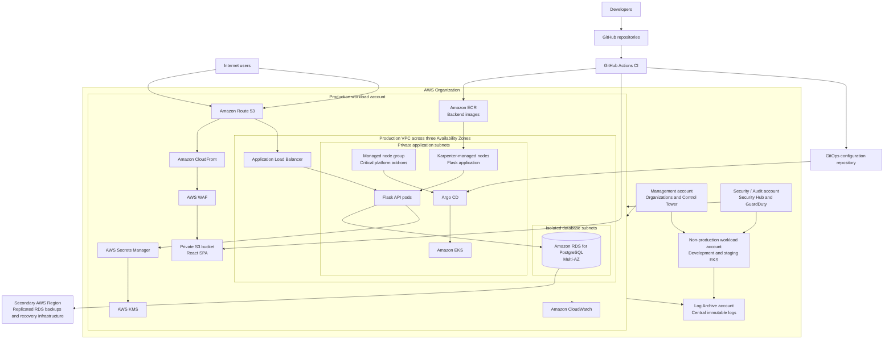

# Innovate Inc. AWS Cloud Architecture

## 1. Executive Summary

Innovate Inc. is developing a web application consisting of:

- A Python/Flask REST API backend
- A React single-page application (SPA)
- A PostgreSQL database
- Continuous integration and continuous delivery workflows

The expected initial traffic is low, at a few hundred users per day, but the platform must be able to grow to support significantly higher traffic without requiring a complete redesign. The application also handles sensitive user data, so security, isolation, encryption, auditability, and controlled access are primary design requirements.

This document proposes an AWS architecture based on:

- AWS Organizations and AWS Control Tower for multi-account governance
- Amazon VPC for network isolation
- Amazon EKS as the managed Kubernetes platform
- Amazon ECR for container images
- Amazon S3 and Amazon CloudFront for the React frontend
- Application Load Balancer and AWS WAF for public API traffic
- Amazon RDS for PostgreSQL for the relational database
- AWS Secrets Manager and AWS KMS for secrets and encryption
- GitHub Actions and Argo CD for CI/CD
- Amazon CloudWatch, AWS CloudTrail, AWS Config, GuardDuty, and Security Hub for observability and security monitoring

The architecture intentionally balances AWS best practices with startup cost constraints. Production receives stronger isolation and availability guarantees, while non-production initially uses a smaller and less expensive footprint.

---

## 2. Scope

This document covers the following areas:

1. AWS account and environment structure
2. VPC and network design
3. Amazon EKS compute architecture
4. Node provisioning, scaling, and resource allocation
5. Container image building, registry, and deployment
6. PostgreSQL database design
7. Backup, high availability, and disaster recovery
8. Security, observability, and cost optimization
9. A high-level architecture diagram

This document describes the target architecture. Detailed Terraform, Helm charts, Kubernetes manifests, and CI/CD workflow files are outside the current scope, but the proposed design assumes that infrastructure and platform configuration will be managed as code.

---

## 3. Assumptions

The following assumptions are used for the initial design:

- AWS is the selected cloud provider.
- The initial primary AWS Region is `eu-central-1`.
- The final Region should be confirmed based on customer location, data residency, latency, service availability, and compliance requirements.
- The backend is stateless and can run multiple replicas.
- The React frontend is compiled into static assets.
- The application initially requires one production environment and shared development and staging environments.
- The initial disaster recovery strategy prioritizes cost efficiency and uses backup and restore in a secondary Region.
- Infrastructure is provisioned with Terraform.
- Kubernetes add-ons and application workloads are deployed using Helm and GitOps.
- GitHub is used for source control and GitHub Actions is used for CI.
- Argo CD is used for continuous delivery to Kubernetes.

---

## 4. Architecture Principles

The design follows these principles:

### 4.1 Security by default

- Production is isolated from development and staging.
- Application nodes and databases do not receive public IP addresses.
- Sensitive data is encrypted in transit and at rest.
- Access is granted through least-privilege IAM roles.
- Long-lived AWS credentials are avoided.
- Security and audit logs are stored outside workload accounts.
- Public traffic passes through managed edge and application security controls.

### 4.2 Managed services over self-managed components

AWS-managed services are preferred when they reduce operational risk. Examples include Amazon EKS, Amazon RDS, Amazon ECR, AWS WAF, AWS Secrets Manager, and CloudWatch.

PostgreSQL will not run inside Kubernetes because operating a stateful production database in Kubernetes would create unnecessary backup, replication, patching, and recovery responsibilities for a small team.

### 4.3 Infrastructure as code

AWS resources, Kubernetes platform components, security controls, and deployment configuration should be version controlled and reviewed through pull requests.

### 4.4 Design for growth without paying for maximum scale immediately

The architecture provides scalable building blocks but starts with modest resource sizes. Horizontal application scaling, Karpenter node provisioning, RDS resizing, read replicas, and additional AWS accounts can be introduced as demand grows.

### 4.5 Separate high availability from disaster recovery

Multi-Availability Zone deployment protects against failures inside the primary Region. Regional disaster recovery requires separate backups, infrastructure definitions, and recovery procedures in another Region.

---

## 5. High-Level Architecture Diagram



### 5.1 Main request paths

Frontend request path:

```text
User
  -> app.innovate.example
  -> Route 53
  -> CloudFront
  -> AWS WAF
  -> Private S3 bucket
  -> React static assets
```

Backend API request path:

```text
React application
  -> api.innovate.example
  -> Route 53
  -> AWS WAF
  -> Application Load Balancer
  -> Kubernetes Ingress
  -> Flask service
  -> Flask pods
  -> RDS for PostgreSQL
```

---

## 6. AWS Account and Environment Structure

### 6.1 Recommended initial accounts

The recommended starting point is five AWS accounts managed through AWS Organizations and AWS Control Tower.

| Account | Purpose |
|---|---|
| Management | AWS Organizations, Control Tower, consolidated billing, and account governance |
| Log Archive | Central storage for CloudTrail, AWS Config, VPC Flow Logs, and other security logs |
| Security / Audit | Delegated administration for Security Hub and GuardDuty, security investigation, and read-only audit access |
| Non-production | Development and staging workloads |
| Production | Production EKS, RDS, ECR, S3, CloudFront, and application infrastructure |

### 6.2 Justification

AWS accounts are strong isolation boundaries. Separating workloads provides:

- Reduced blast radius
- Independent IAM and resource policies
- Clear production and non-production separation
- Easier cost allocation
- Separate service quotas
- Better auditability
- Central security controls without giving security tooling direct ownership of application resources

The AWS Organizations management account must not host application workloads. Its credentials should be tightly protected and used only for organization-level administration.

### 6.3 Why development and staging initially share an account

For a small startup, creating separate accounts for every environment may create unnecessary cost and management overhead. Development and staging can initially share the non-production account while remaining separated through:

- Separate Kubernetes namespaces
- Separate IAM roles
- Separate application configuration
- Separate database instances or databases
- Separate DNS records
- Separate deployment pipelines
- Kubernetes ResourceQuota and NetworkPolicy controls

As the company grows, development and staging can be moved to independent accounts without changing the production architecture.

### 6.4 Organizational Units

A simple AWS Organizations structure is preferred:

```text
Root
├── Management account
├── Security OU
│   ├── Log Archive account
│   └── Security / Audit account
├── Non-Production OU
│   └── Non-production workload account
└── Production OU
    └── Production workload account
```

Service Control Policies should be applied at the Organizational Unit level. Example controls include:

- Deny disabling CloudTrail and AWS Config
- Deny leaving the AWS Organization
- Restrict deployment to approved AWS Regions
- Deny public Amazon S3 access unless explicitly exempted
- Deny actions that would remove required security services
- Protect centralized log storage from workload administrators

---

## 7. Network Design

### 7.1 VPC separation

Production and non-production use separate VPCs in separate AWS accounts.

Example address ranges:

```text
Production VPC:      10.10.0.0/16
Non-production VPC:  10.20.0.0/16
```

### 7.2 Availability Zone design

The production VPC spans three Availability Zones. Each Availability Zone contains:

- Public subnet
- Private application subnet
- Isolated database subnet
- Optional small cluster/control-plane subnet

The private application subnets should receive the largest address ranges because EKS pods consume VPC IP addresses when using the Amazon VPC CNI.

An illustrative subnet plan is:

| Availability Zone | Public | Private application | Isolated database |
|---|---:|---:|---:|
| AZ A | `/24` | `/19` | `/24` |
| AZ B | `/24` | `/19` | `/24` |
| AZ C | `/24` | `/19` | `/24` |


### 7.3 Public subnets

Public subnets contain only internet-facing infrastructure that requires direct routing through an Internet Gateway, primarily:

- Application Load Balancer
- NAT Gateways

EKS nodes, application pods, and RDS do not run in public subnets.

### 7.4 Private application subnets

Private application subnets contain:

- EKS managed system nodes
- Karpenter-managed application nodes
- Application pods
- Internal load balancers, if required
- VPC endpoints

Nodes do not receive public IP addresses.

### 7.5 Isolated database subnets

The database subnet route tables have no route to:

- Internet Gateway
- NAT Gateway

RDS is reachable only from explicitly approved application security groups and administrative processes.

### 7.6 NAT Gateway design

Production uses one NAT Gateway per Availability Zone. Private subnet traffic is routed to the NAT Gateway in the same Availability Zone.

This avoids a single point of failure and prevents normal egress from depending on another Availability Zone.

To reduce cost, non-production can initially use one shared NAT Gateway. This is an explicit trade-off: it lowers cost but reduces availability and may introduce cross-AZ data processing charges.

### 7.7 VPC endpoints

VPC endpoints reduce NAT traffic and allow AWS service access without traversing the public internet.

Recommended endpoints include:

- Amazon S3 gateway endpoint
- Amazon ECR API interface endpoint
- Amazon ECR Docker interface endpoint
- AWS STS interface endpoint
- CloudWatch Logs interface endpoint
- AWS Secrets Manager interface endpoint
- AWS Systems Manager interface endpoints
- EC2 interface endpoint, if required
- Elastic Load Balancing interface endpoint, if required by controllers

Endpoint policies should restrict access to approved services, accounts, and resources where practical.

### 7.8 EKS API endpoint

The production EKS Kubernetes API should use private endpoint access.

Administrative access can be provided through:

- AWS Client VPN
- A corporate VPN or Direct Connect connection
- An SSM-managed administrative EC2 instance
- A controlled CI/CD or GitOps component running inside the VPC

### 7.9 DNS

Amazon Route 53 hosts public DNS zones.

Example records:

```text
app.innovate.example  -> CloudFront distribution
api.innovate.example  -> Application Load Balancer
```

Private Route 53 hosted zones can be introduced for internal services.

### 7.10 Network security controls

Network security is enforced at multiple levels:

1. AWS WAF filters malicious and abusive public requests.
2. The Application Load Balancer accepts only HTTPS.
3. Security groups restrict traffic between load balancer, EKS, and RDS.
4. Network ACLs provide coarse subnet-level protection.
5. Kubernetes NetworkPolicies restrict pod-to-pod communication.
6. VPC Flow Logs provide network audit data.
7. RDS is isolated from direct internet access.
8. EKS nodes and pods do not receive public IP addresses.

Example security group flow:

```text
Internet
  -> ALB security group on TCP 443
  -> EKS application security group on the application port
  -> RDS security group on TCP 5432
```

The RDS security group must reference the application security group rather than allow a broad VPC CIDR.

---

## 8. Public Edge and Frontend Architecture

### 8.1 React SPA hosting

The React application is hosted using:

- A private Amazon S3 bucket
- Amazon CloudFront
- CloudFront Origin Access Control
- AWS WAF
- AWS Certificate Manager
- Route 53

The S3 bucket must block all public access. CloudFront accesses it through Origin Access Control.

This design is preferable to hosting the SPA in EKS because it:

- Costs less
- Scales automatically
- Reduces Kubernetes resource usage
- Reduces the application attack surface
- Provides global caching
- Requires less operational maintenance

---

## 9. Amazon EKS Compute Platform

### 9.1 Cluster strategy

Use:

- One EKS cluster in the production account
- One EKS cluster in the non-production account

Development and staging initially use separate namespaces in the non-production cluster.

Production receives a dedicated cluster to prevent:

- Development workloads exhausting production capacity
- Shared cluster administrator privileges
- Accidental cross-environment changes
- Production outages caused by non-production experimentation
- Shared Kubernetes control-plane configuration risk

### 9.2 Kubernetes version management

The cluster should run a currently supported EKS Kubernetes version. Upgrades should be planned and tested in this order:

1. Development
2. Staging
3. Production

Platform add-ons, controllers, and application compatibility must be validated before each control-plane and node upgrade.

### 9.3 Pod scaling

The Flask deployment uses Horizontal Pod Autoscaler.

Initial scaling signals:

- CPU utilization
- Memory utilization, when meaningful

Future scaling signals:

- HTTP request rate
- Request latency
- Queue depth
- Custom business metrics

An illustrative policy is:

```text
Minimum replicas: 2
Maximum replicas: 20
Target CPU utilization: 60-70%
```

The exact values must be determined through load testing.

### 9.4 Node scaling

Karpenter reacts to pod scheduling requirements and launches appropriately sized nodes. It should be configured to:

- Use multiple instance types
- Use multiple Availability Zones
- Consolidate underutilized nodes
- Respect PodDisruptionBudgets
- Set total CPU and memory limits for each NodePool
- Avoid unsupported or excessively large instance families
- Prefer modern-generation instances
- Provide sufficient diversity for Spot availability

### 9.5 Resource allocation

Every application container must define:

- CPU request
- Memory request
- CPU limit
- Memory limit

Requests allow Kubernetes and Karpenter to make accurate scheduling decisions. Limits protect the cluster from uncontrolled resource consumption.

Example starting point:

```yaml
resources:
  requests:
    cpu: 250m
    memory: 256Mi
  limits:
    cpu: "1"
    memory: 1Gi
```

These are placeholders and must be updated after profiling and load testing.

### 9.6 Namespace controls

Development and staging namespaces should use:

- `ResourceQuota`
- `LimitRange`
- NetworkPolicy
- Separate service accounts
- Separate Secrets Manager paths
- Separate Argo CD projects
- Separate ingress hostnames
- Separate database credentials

### 9.7 Workload resilience

Production workloads should include:

- Minimum two replicas
- Readiness probes
- Liveness probes
- Startup probes
- Rolling update strategy
- PodDisruptionBudget
- Topology spread constraints
- Graceful shutdown
- Appropriate termination grace period
- Retry logic with exponential backoff
- Database connection timeouts
- Idempotent request handling where possible

---

## 10. Containerization and Image Registry

### 10.1 Flask backend image

The backend Dockerfile should:

- Use a multi-stage build
- Pin the Python major and minor version
- Install only production dependencies in the final image
- Run as a non-root user
- Use a minimal runtime base image
- Avoid copying source-control metadata and secrets
- Expose only the required application port
- Define a health endpoint

The Flask development server must not be used in production.

### 10.2 Frontend build

The React frontend is built in CI. The generated static files are uploaded to the environment-specific S3 bucket.

Environment-dependent frontend values must be treated carefully because values embedded during a React build are visible to browser users. Secrets must never be included in frontend environment variables.

### 10.3 Amazon ECR

Amazon ECR stores private backend images.

Recommended controls:

- Separate repositories or repository prefixes by application
- Immutable release tags
- Git commit SHA tags
- Deployment by image digest
- Enhanced image scanning
- Lifecycle policies
- KMS encryption where required

Example image reference:

```text
123456789012.dkr.ecr.eu-central-1.amazonaws.com/innovate/api@sha256:<digest>
```

Deploying by digest guarantees that the exact tested image is used.

### 10.4 Software supply-chain controls

The pipeline should include:

- Dependency vulnerability scanning
- Container image scanning
- Secret scanning
- Static application security testing
- Approved commits or protected branches

A critical vulnerability should block production promotion unless formally accepted through a documented exception.

---

## 11. CI/CD and GitOps

### 11.1 CI pipeline

GitHub Actions performs:

1. Source checkout
2. Dependency installation
3. Formatting and linting
4. Unit tests
5. Security and dependency scans
6. Backend image build
7. Image scan
8. Image push to ECR
9. React production build
10. Static asset upload to S3
11. CloudFront cache invalidation when required
12. GitOps configuration update with the new image digest

### 11.2 AWS authentication

GitHub Actions uses OpenID Connect to assume an AWS IAM role.

Long-lived AWS access keys must not be stored in GitHub Secrets.

Separate roles should be used for:

- Non-production deployment
- Production deployment
- ECR publishing
- Frontend publishing
- Infrastructure planning and application

Production role assumption should require:

- Protected branches
- Protected GitHub environments
- Approval rules
- Limited repository and workflow claims
- Least-privilege IAM permissions

### 11.3 Continuous delivery

Argo CD runs inside each EKS cluster and monitors the GitOps repository.

Deployment flow:

```text
Application code merge
  -> CI tests and scans
  -> Image pushed to ECR
  -> GitOps repository updated with image digest
  -> Argo CD detects change
  -> Argo CD applies Helm release
  -> Kubernetes performs rolling deployment
  -> Health and smoke checks confirm deployment
```

Benefits include:

- No external direct access to the private EKS API
- Auditable desired state in Git
- Easy rollback through Git history
- Drift detection
- Clear separation between image building and deployment

### 11.4 Promotion strategy

A container image is built once and promoted between environments by digest.

Recommended flow:

```text
Build image
  -> Deploy to development
  -> Automated tests
  -> Promote same digest to staging
  -> Integration and acceptance tests
  -> Manual approval
  -> Promote same digest to production
```

The production image must not be rebuilt after staging validation.

### 11.5 Database migrations

Database migrations should run as a controlled Kubernetes Job or a dedicated CI/CD step.

The process must:

- Run once per deployment
- Use a dedicated IAM role and database identity
- Prevent multiple concurrent migration jobs
- Remain backward compatible during rolling deployments
- Back up or verify recovery capability before destructive changes
- Separate schema expansion from later schema cleanup

---

## 12. Database Architecture

### 12.1 Recommended service

Use Amazon RDS for PostgreSQL.

It provides:

- Managed backups
- Point-in-time recovery
- Multi-AZ availability
- Automated maintenance capabilities
- Monitoring integrations
- Read replicas
- Storage and instance scaling
- Encryption through AWS KMS
- TLS connections
- Reduced database operational burden

### 12.2 Why PostgreSQL should not run in EKS

Running PostgreSQL in Kubernetes would require the team to own:

- Stateful replication
- Persistent volume recovery
- Database-aware backups
- Failover orchestration
- Patching
- Storage performance tuning
- Recovery testing
- Data corruption procedures

Amazon RDS provides these capabilities as a managed service and is better suited to a small team handling sensitive data.

### 12.3 Production configuration

Recommended production controls:

- Multi-AZ deployment
- Private isolated database subnets
- No public accessibility
- KMS encryption
- TLS required
- Credentials in AWS Secrets Manager
- Security-group access only from the application
- Automated backups
- Point-in-time recovery
- Deletion protection
- Performance Insights or Database Insights
- Enhanced Monitoring
- CloudWatch alarms
- Controlled maintenance window
- Minor version patching policy
- Parameter and option groups managed as code

The exact instance class and storage size should start modestly and be selected after performance testing.

### 12.4 Non-production configuration

Non-production can use:

- A smaller Single-AZ RDS instance
- Shorter backup retention
- Scheduled start and stop where operationally acceptable
- Separate development and staging databases
- Lower-cost storage and monitoring settings

Production data must not be copied to non-production unless it has been anonymized or tokenized.

### 12.5 Database credentials

Database credentials are stored in AWS Secrets Manager.

Applications access secrets through EKS Pod Identity and either:

- External Secrets Operator, or
- AWS Secrets Store CSI Driver

Secrets must not be:

- Committed to Git
- Embedded in container images
- Stored in Terraform state as plaintext
- Added to frontend build variables
- Logged by the application

### 12.6 Read scaling

When read traffic grows:

1. Optimize queries and indexes.
2. Add application caching where appropriate.
3. Add one or more RDS read replicas.
4. Route read-only traffic to replicas.
5. Evaluate Aurora PostgreSQL only when its capabilities and cost are justified.

The initial architecture should not adopt Aurora solely because it may be needed at a hypothetical future scale.

---

## 13. Backups, High Availability, and Disaster Recovery

### 13.1 High availability

High availability inside the primary Region includes:

- EKS control plane managed by AWS
- Worker capacity across multiple Availability Zones
- Multiple Flask replicas
- Topology spread constraints
- Application Load Balancer across Availability Zones
- NAT Gateway per Availability Zone in production
- RDS Multi-AZ
- Stateless application design
- Re-creatable infrastructure and workloads

### 13.2 RDS backup policy

Recommended starting production policy:

- Automated backup retention: 14 to 35 days
- Point-in-time recovery enabled
- Daily automated snapshots
- Additional manual snapshots before major changes
- Final snapshot required before deletion
- Backup encryption using AWS KMS
- Cross-Region automated backup replication
- Backup monitoring and failure alerting

The final retention period must reflect legal, contractual, privacy, and business requirements.

### 13.3 Disaster recovery strategy

The initial recommendation is backup and restore in a secondary AWS Region.

This is appropriate because:

- Initial traffic is low
- The startup is cost sensitive
- A continuously running duplicate platform would be expensive
- Terraform, GitOps, and replicated backups allow the environment to be reconstructed

The secondary Region contains or receives:

- Replicated RDS snapshots and transaction logs
- Optional ECR image replication
- Infrastructure code
- Kubernetes and Helm configuration
- Encrypted configuration backups
- A documented recovery runbook

### 13.4 Recovery process

An illustrative regional recovery process is:

1. Declare the primary Region unavailable.
2. Provision or validate the secondary-region network.
3. Provision EKS and required controllers.
4. Restore RDS to the latest acceptable recovery point.
5. Restore or deploy application configuration.
6. Deploy the tested application image from ECR.
7. Validate database and application health.
8. Change Route 53 records or failover routing.
9. Monitor errors and data consistency.
10. Record the incident and recovery timeline.

### 13.6 Future disaster recovery maturity

As business impact grows, the design can evolve to:

- Warm standby EKS cluster in another Region
- Cross-Region RDS read replica
- Pre-provisioned networking and security controls
- ECR cross-Region replication
- S3 cross-Region replication
- Route 53 health checks and failover records
- Automated recovery orchestration
- More frequent DR exercises

### 13.7 Recovery testing

A backup is not considered reliable until it has been restored successfully.

Recommended testing:

- Monthly automated backup status review
- Quarterly RDS restore test
- Semiannual regional recovery exercise
- Recovery timing measurement
- Application-level data validation
- Runbook update after each exercise

## 14. AWS References

- [Organizing Your AWS Environment Using Multiple Accounts](https://docs.aws.amazon.com/whitepapers/latest/organizing-your-aws-environment/organizing-your-aws-environment.html)
- [AWS Organizations best practices](https://docs.aws.amazon.com/organizations/latest/userguide/orgs_best-practices.html)
- [AWS account management and separation](https://docs.aws.amazon.com/wellarchitected/latest/security-pillar/aws-account-management-and-separation.html)
- [Amazon EKS Best Practices Guide](https://docs.aws.amazon.com/eks/latest/best-practices/introduction.html)
- [Amazon EKS VPC and subnet considerations](https://docs.aws.amazon.com/eks/latest/best-practices/subnets.html)
- [Amazon EKS Karpenter best practices](https://docs.aws.amazon.com/eks/latest/best-practices/karpenter.html)
- [Amazon EKS managed node groups](https://docs.aws.amazon.com/eks/latest/userguide/managed-node-groups.html)
- [Amazon RDS for PostgreSQL](https://docs.aws.amazon.com/AmazonRDS/latest/UserGuide/CHAP_PostgreSQL.html)
- [Amazon RDS automated backups](https://docs.aws.amazon.com/AmazonRDS/latest/UserGuide/USER_WorkingWithAutomatedBackups.html)
- [Replicating Amazon RDS automated backups to another Region](https://docs.aws.amazon.com/AmazonRDS/latest/UserGuide/USER_ReplicateBackups.html)
- [Amazon ECR tag immutability](https://docs.aws.amazon.com/AmazonECR/latest/userguide/image-tag-mutability.html)
- [Amazon ECR enhanced image scanning](https://docs.aws.amazon.com/AmazonECR/latest/userguide/image-scanning-enhanced-enabling.html)
